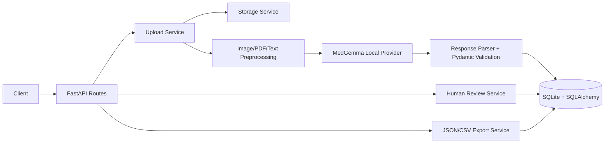

# Medical Document Review Backend

FastAPI backend for uploading, preprocessing, extracting, reviewing, tracking, and exporting prescription and x-ray documents.

## Run Locally

```powershell
cd backend
.\venv\Scripts\activate
pip install -r requirements.txt
uvicorn main:app --reload --host 127.0.0.1 --port 8000
```

API docs are available at `http://127.0.0.1:8000/docs`.

## Environment

Copy `.env.example` to `.env` and set:

```env
APP_NAME=Medical Document Review API
APP_VERSION=1.0.0
DEBUG=False
HOST=127.0.0.1
PORT=8000
DATABASE_URL=sqlite:///./medical_document.db
MEDGEMMA_API_URL=http://localhost:11434/v1/chat/completions
MODEL_NAME=medgemma:4b
LOG_LEVEL=INFO
```

## Supported Documents

- Prescription: JPG, JPEG, PNG, PDF, TXT
- X-ray: JPG, JPEG, PNG, PDF, TXT

File type is normalized to `image`, `pdf`, or `text`; document category is `prescription` or `xray`.

## Architecture



## API Design

- `GET /` health check
- `POST /upload` upload document
- `POST /documents/upload` upload document, grouped route
- `GET /documents` list documents
- `GET /documents/{document_id}` fetch one document
- `DELETE /documents/{document_id}` delete document metadata
- `POST /extract` run preprocessing, MedGemma inference, parsing, metadata logging
- `GET /review/{document_id}` fetch review
- `PUT /review/{document_id}` approve, reject, or mark needs changes
- `GET /metadata/{document_id}` fetch AI execution metadata
- `GET /export/json` export reviewed documents as JSON
- `GET /export/csv` export reviewed documents as CSV

## SQLite Schema

- `users`: reviewer identity
- `medical_documents`: category, file type, original/stored filename, path, status, timestamps
- `extractions`: structured AI JSON per document
- `medications`: prescription medication rows linked to an extraction
- `reviews`: review status, reviewer notes, edited reviewed data
- `run_metadata`: model, runtime, prompt version, latency, processing time, category, file type, errors
- `export_history`: export format, user, document count, timestamp

The app calls `ensure_schema()` on startup so local SQLite databases receive missing additive columns. Alembic migrations are also included for managed environments.

## AI Workflow

1. Upload validates category, MIME type, extension, and size.
2. Original file is stored under `backend/storage`.
3. Images are resized, grayscaled, denoised, contrast-enhanced, and deskewed.
4. PDFs are rendered with PyMuPDF into per-page images, then each page is processed.
5. Text files are copied into processed text storage.
6. Prompt is selected from `backend/prompts`.
7. Local Ollama MedGemma receives text and/or processed images.
8. Response is parsed as JSON and validated with Pydantic.
9. Extraction, medications, document status, and run metadata are saved.

## Review Workflow

Reviewers fetch the original document metadata and extracted JSON, submit edited data through `PUT /review/{document_id}`, then mark status as `approved`, `rejected`, or `needs_changes`. Approved records are exported by the JSON/CSV endpoints.

## Testing

```powershell
backend\venv\Scripts\python.exe -m pytest backend\tests -q
```

Current tests cover image/PDF preprocessing with generated temporary fixtures. Add provider tests with a mocked `MedGemmaProvider` to verify integration behavior.
