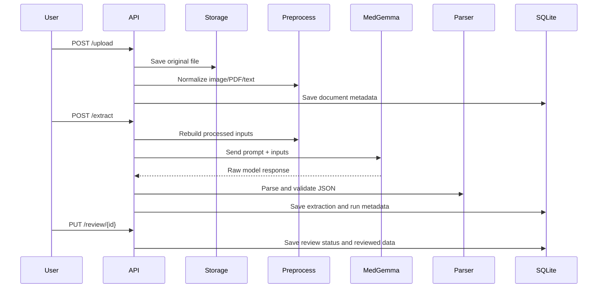

# Backend Architecture

## Folder Structure

```text
backend/
├── api/routes/          FastAPI endpoints
├── services/            Business workflows
├── providers/           External AI provider clients
├── parsers/             AI response parsing and validation
├── prompts/             Prompt files and prompt versions
├── models/              SQLAlchemy models
├── schemas/             Pydantic request/response schemas
├── database/            Engine, sessions, schema initialization
├── storage/             Original and processed files
├── config/              Settings, logging, storage paths
├── middleware/          Request logging
├── utils/               File, image, PDF, UUID helpers
├── tests/               Backend tests
├── logs/                Application logs
├── migrations/          Alembic migrations
├── main.py
├── requirements.txt
└── .env
```

## Processing Flow


